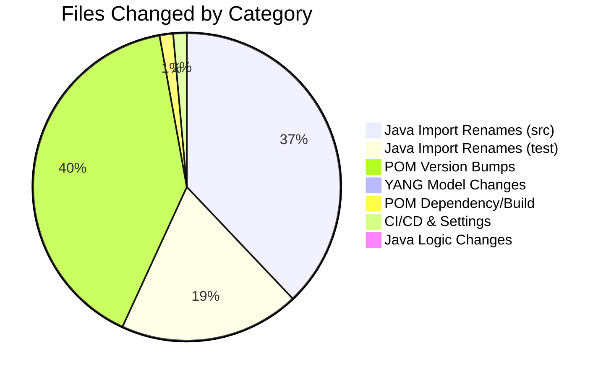

# NETCONF YANG Model Upgrade Analysis: `rev110601` → `rev130929`

## Overview

| Aspect | Detail |
|---|---|
| **Original Repo** | `netconf` — OpenDaylight Netconf v6.0.6 (release tag) |
| **Enhanced Repo** | `netconf-IOSMCN` — IOS-MCN SMO fork, branch `v6.0.6-ios-mcn` |
| **Key Commit** | [`209c83444`](file:///c:/Users/sridh/Documents/GitHub/netconf-IOSMCN) — *"Upgrade to NETCONF revision 2013-09-29"* by Ravi Pendurty (2025-03-25) |
| **Total Files Changed** | **215 files** (252 insertions, 255 deletions) |
| **Core YANG Change** | `ietf-netconf@2011-06-01.yang` → `ietf-netconf@2013-09-29.yang` |
| **RFC Reference** | RFC 6241 (NETCONF Protocol) + RFC 6536 (NETCONF Access Control Model / NACM) |

---

## 1. Motivation & Context

The original ODL Netconf v6.0.6 ships the `ietf-netconf` YANG model at **revision 2011-06-01** (RFC 6241). When used as an SDN-R (Software Defined Networking - Radio) controller, this older revision caused compatibility bugs because many NETCONF devices in O-RAN environments advertise and expect the **revision 2013-09-29** model, which adds NACM (NETCONF Access Control Model) attributes per RFC 6536.

The upgrade ensures that the ODL-based SDNR controller:
- Correctly negotiates capabilities with network elements advertising the 2013 revision
- Supports NACM `default-deny-all` annotations on sensitive operations (`delete-config`, `kill-session`)
- Resolves schema mismatches that caused runtime errors during device mount/session negotiation

---

## 2. YANG Model Changes (Core of the Enhancement)

### 2.1 Primary Change: `ietf-netconf` Model Upgrade

| Aspect | Original | Enhanced |
|---|---|---|
| **File** | [ietf-netconf@2011-06-01.yang](file:///c:/Users/sridh/Documents/GitHub/netconf/model/rfc6241/src/main/yang/ietf-netconf@2011-06-01.yang) | [ietf-netconf@2013-09-29.yang](file:///c:/Users/sridh/Documents/GitHub/netconf-IOSMCN/model/rfc6241/src/main/yang/ietf-netconf@2013-09-29.yang) |
| **Revision** | `2011-06-01` | `2013-09-29` (new primary), `2011-06-01` (preserved) |
| **NACM Import** | ❌ Not present | ✅ `import ietf-netconf-acm { prefix nacm; }` |
| **NACM Annotations** | ❌ None | ✅ `nacm:default-deny-all` on `delete-config` and `kill-session` RPCs |

#### Specific YANG Diff

```diff
+ import ietf-netconf-acm { prefix nacm; }

+ revision 2013-09-29 {
+   description "Updated to include NACM attributes";
+   reference "RFC 6536: sec 3.2.5 and 3.2.8";
+ }

  revision 2011-06-01 {
    description
-     "Initial revision;";
+     "Initial revision";
  }

  rpc delete-config {
+   nacm:default-deny-all;
    description "Delete a configuration datastore.";
    ...
  }

  rpc kill-session {
+   nacm:default-deny-all;
    description "Force the termination of a NETCONF session.";
    ...
  }
```

> [!IMPORTANT]
> The `nacm:default-deny-all` annotation means that by default, no user is authorized to invoke `delete-config` or `kill-session` unless explicitly granted permission via NACM rules. This is a security hardening measure from RFC 6536, sections 3.2.5 and 3.2.8.

### 2.2 New POM Dependency for RFC 8341 (NACM)

Since the YANG model now imports `ietf-netconf-acm`, the [rfc6241/pom.xml](file:///c:/Users/sridh/Documents/GitHub/netconf-IOSMCN/model/rfc6241/pom.xml) was updated to add a dependency on the ACM model:

```diff
+ <dependency>
+     <groupId>org.opendaylight.netconf.model</groupId>
+     <artifactId>rfc8341</artifactId>
+ </dependency>
```

### 2.3 Secondary Change: `ietf-netconf-notifications` Cleanup

The [ietf-netconf-notifications@2012-02-06.yang](file:///c:/Users/sridh/Documents/GitHub/netconf-IOSMCN/model/rfc6470/src/main/yang/ietf-netconf-notifications@2012-02-06.yang) file received several fixes:

| Change | Detail |
|---|---|
| **Removed `revision-date` constraints** | `import ietf-inet-types` and `import ietf-netconf` no longer pin to specific revision dates, allowing flexible resolution |
| **XPath fix** | `when "confirm-event != 'timeout'"` → `when "../confirm-event != 'timeout'"` (corrected relative path) |
| **Whitespace cleanup** | Removed excessive blank lines throughout the file |
| **Description fix** | Removed "Errata 3957 added." from the revision description |

```diff
- import ietf-inet-types { prefix inet; revision-date "2013-07-15";}
- import ietf-netconf { prefix nc; revision-date "2011-06-01";}
+ import ietf-inet-types { prefix inet; }
+ import ietf-netconf { prefix nc; }
```

> [!NOTE]
> Removing the `revision-date` from the `import ietf-netconf` statement is **essential** — without this, the notifications model would continue to bind to the old `2011-06-01` revision and fail to compile against the new `2013-09-29` model.

```diff
  uses common-session-parms {
-   when "confirm-event != 'timeout'";
+   when "../confirm-event != 'timeout'";
  }
```

> [!TIP]
> The `../confirm-event` XPath fix corrects a YANG validation issue. Per YANG semantics, the `when` expression inside a `uses` refers to the data node context, so `../` is needed to navigate to the sibling leaf `confirm-event`.

---

## 3. Java Source Code Impact (Import Package Rename)

The YANG revision change from `2011-06-01` to `2013-09-29` causes the **YANG-to-Java code generator** (yangtools) to produce classes under a different package:

```
- org.opendaylight.yang.gen.v1.urn.ietf.params.xml.ns.netconf.base._1._0.rev110601.*
+ org.opendaylight.yang.gen.v1.urn.ietf.params.xml.ns.netconf.base._1._0.rev130929.*
```

This is a **mechanical, project-wide change** affecting **~200 Java files** across all modules. The code logic itself is **unchanged** — only the import statements and fully-qualified class references are updated.

### 3.1 Affected Java Types (Key Classes)

The following auto-generated types changed their package path:

| Type | Usage |
|---|---|
| `SessionIdType` | Used in ~80+ files across server, client, plugins, test tools |
| `IetfNetconfService` | Service interface for NETCONF base operations |
| `CommitInput`, `EditConfigInput` | RPC input containers |
| `ConfigTarget`, `ConfigSource` | Choice/case types for target/source datastores |
| `EditContent` | Edit-config content choice |
| `Candidate` | Candidate datastore case |
| `$YangModuleInfoImpl` | Module metadata registration |

### 3.2 Modules with Java Changes

| Module Path | Files Changed | Change Type |
|---|---|---|
| `plugins/netconf-client-mdsal/` | ~15 (src + test) | Import rename + test date strings |
| `plugins/netconf-server-mdsal/` | ~20 | Import rename |
| `plugins/netconf-common-mdsal/` | 1 | Import rename |
| `protocol/netconf-api/` | 2 (src + test) | Import rename |
| `protocol/netconf-client/` | 6 (src + test) | Import rename |
| `protocol/netconf-server/` | 15 (src + test) | Import rename |
| `netconf/tools/netconf-testtool/` | ~20 | Import rename |
| `apps/` | 4 | Import rename |

### 3.3 Non-Trivial Java Changes

Beyond import renames, a few files had **substantive updates**:

#### [DefaultBaseNetconfSchemas.java](file:///c:/Users/sridh/Documents/GitHub/netconf-IOSMCN/plugins/netconf-client-mdsal/src/main/java/org/opendaylight/netconf/client/mdsal/impl/DefaultBaseNetconfSchemas.java)
Updated the `$YangModuleInfoImpl` reference to point to the new revision, ensuring the schema context is built with the correct model:
```diff
- org.opendaylight.yang.gen.v1.urn.ietf.params.xml.ns.netconf.base._1._0.rev110601
+ org.opendaylight.yang.gen.v1.urn.ietf.params.xml.ns.netconf.base._1._0.rev130929
      .$YangModuleInfoImpl.getInstance(),
```

#### [NetconfDeviceRpcTest.java](file:///c:/Users/sridh/Documents/GitHub/netconf-IOSMCN/plugins/netconf-client-mdsal/src/test/java/org/opendaylight/netconf/client/mdsal/spi/NetconfDeviceRpcTest.java)
Updated hard-coded QName date strings in test assertions:
```diff
- type = QName.create("urn:ietf:params:xml:ns:netconf:base:1.0", "2011-06-01", "get-config");
+ type = QName.create("urn:ietf:params:xml:ns:netconf:base:1.0", "2013-09-29", "get-config");
```

---

### 3.4 How the Bulk Changes Were Made (Automation)

The ~120 Java import renames and ~85 POM version bumps were **not done manually**. They were automated:

- **Java imports**: A project-wide find-and-replace of the string `rev110601` → `rev130929` (e.g., `find . -name "*.java" -exec sed -i 's/rev110601/rev130929/g' {} +`). Every Java change follows the exact same mechanical substitution pattern with zero logic differences.
- **POM versions**: The standard Maven command `mvn versions:set -DnewVersion=6.0.6-SNAPSHOT`, which recursively updates all `<version>` tags across the multi-module project.

The only **genuinely manual** work was:
1. Replacing the YANG model file (`@2011-06-01` → `@2013-09-29`)
2. Fixing the `ietf-netconf-notifications` YANG (removing `revision-date` pins, XPath correction)
3. Adding the `rfc8341` dependency to `model/rfc6241/pom.xml`
4. Adding the `skip-deploy` build plugin to `artifacts/pom.xml`
5. Setting up CI/CD (workflow + `settings.xml`)

---

## 4. Build & Version Changes

### 4.1 Version Bump: `6.0.6` → `6.0.6-SNAPSHOT`

All POM files across the project had their version changed from the release tag `6.0.6` to `6.0.6-SNAPSHOT`, indicating this is a development/custom build. This affects:

- [Root pom.xml](file:///c:/Users/sridh/Documents/GitHub/netconf-IOSMCN/pom.xml) — `netconf-aggregator`
- [parent/pom.xml](file:///c:/Users/sridh/Documents/GitHub/netconf-IOSMCN/parent/pom.xml) — `netconf-parent` + `netconf-artifacts` dependency
- [artifacts/pom.xml](file:///c:/Users/sridh/Documents/GitHub/netconf-IOSMCN/artifacts/pom.xml) — `netconf-artifacts`
- All ~200 child module POMs (via `<parent><version>`)

### 4.2 Deploy Skip Configuration

The [artifacts/pom.xml](file:///c:/Users/sridh/Documents/GitHub/netconf-IOSMCN/artifacts/pom.xml) added a build plugin to **skip Maven deployment** for the artifacts module:

```xml
<build>
  <plugins>
    <plugin>
      <artifactId>maven-deploy-plugin</artifactId>
      <version>2.8</version>
      <executions>
        <execution>
          <id>skip-deploy</id>
          <phase>deploy</phase>
          <goals><goal>deploy</goal></goals>
          <configuration>
            <skip>true</skip>
          </configuration>
        </execution>
      </executions>
    </plugin>
  </plugins>
</build>
```

### 4.3 Third-Party `shaded-exificient`

The [shaded-exificient/pom.xml](file:///c:/Users/sridh/Documents/GitHub/netconf-IOSMCN/third-party/shaded-exificient/pom.xml) had its own version and internal dependency version updated from `6.0.6` to `6.0.6-SNAPSHOT`.

---

## 5. CI/CD Additions

The enhanced repo includes a GitHub Actions workflow not present in the original:

### [.github/workflows/maven.yml](file:///c:/Users/sridh/Documents/GitHub/netconf-IOSMCN/.github/workflows/maven.yml)

| Aspect | Detail |
|---|---|
| **Trigger** | Push to `v6.0.6-ios-mcn` branch + manual `workflow_dispatch` |
| **JDK** | 17 (Temurin) |
| **Build Step** | `mvn validate` (schema validation only) |
| **Deploy Step** | Publishes to `https://maven.pkg.github.com/ios-mcn-smo/netconf` |
| **Auth** | Uses `secrets.PACKAGE_ACCESS_PAT` for GitHub Packages |

Also added: [settings.xml](file:///c:/Users/sridh/Documents/GitHub/netconf-IOSMCN/settings.xml) for Maven repository authentication configuration.

---

## 6. Commit History (IOS-MCN Fork)

The fork builds on the original `v6.0.6` release with the following commits (oldest first):

| Commit | Description |
|---|---|
| `209c83444` | **Upgrade to NETCONF revision 2013-09-29** ← Core change |
| `7206ba53f` | Include workflows for CI/CD |
| `71de7aee7` | Correct repo name |
| `114cd9dce` | Skip deployment |
| `64f5e32a5` | Update version |
| `e6612e319` | Update workflow |
| `7fc26e242` | Update versions to 6.0.60-SNAPSHOT (typo, later fixed) |
| `a35a9a26f` | Update versions to 6.0.6-SNAPSHOT |
| `dd218fe14` | Merge branch |
| `c6f95b99b` → `a5b46be91` | Settings, auth, and workflow refinements |

---

## 7. Summary of Change Categories



| Category | Count | Risk Level |
|---|---|---|
| **YANG Model (core change)** | 2 files | 🔴 High — changes the NETCONF base namespace revision |
| **Java Import Renames** | ~120 files | 🟢 Low — mechanical, compile-time verified |
| **Java Logic Changes** | 2 files | 🟡 Medium — `DefaultBaseNetconfSchemas` + test date strings |
| **POM Version Bumps** | ~85 files | 🟢 Low — `6.0.6` → `6.0.6-SNAPSHOT` |
| **POM Build/Dependency** | 3 files | 🟡 Medium — `rfc8341` dependency, deploy skip |
| **CI/CD** | 3 files | 🟢 Low — new workflow + settings |

---

## 8. Potential Impact & Considerations

> [!WARNING]
> **Binary Compatibility**: The YANG revision change produces different Java package paths (`rev110601` → `rev130929`). Any downstream project that depends on the original ODL Netconf v6.0.6 JARs and imports from the `rev110601` package will **fail to compile** against the enhanced version. This is a **breaking API change** for consumers of the generated bindings.

> [!IMPORTANT]
> **NACM Dependency**: The enhanced model now has a transitive dependency on `ietf-netconf-acm` (RFC 8341 / `rfc8341` artifact). Any deployment environment must include this model in its schema context, or YANG compilation will fail.

> [!NOTE]
> **Backward Compatibility of the Protocol**: At the NETCONF wire protocol level, the XML namespace (`urn:ietf:params:xml:ns:netconf:base:1.0`) is **unchanged**. The revision change only affects the YANG binding layer. Network elements advertising either the `2011-06-01` or `2013-09-29` revision in their `<hello>` capabilities will still be handled, as the namespace URI is the actual key for protocol negotiation.
